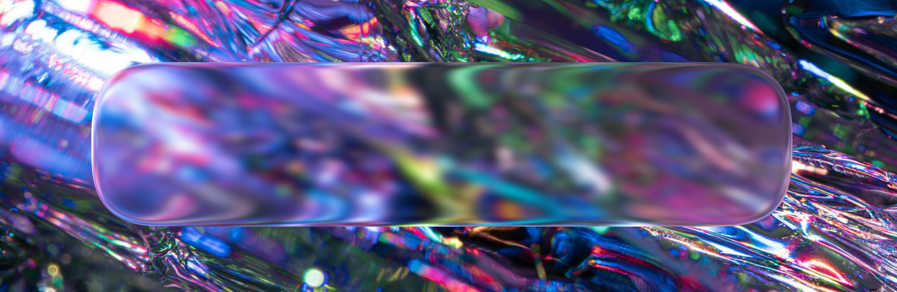

# aurum-linux

This is a Linux sandbox for an Aurum system **and currently WIP (Work In Progress)**.

Currently the sandbox only showcases the GLSL glass effect that will be used in the Bismuth subsystem. To change the wallpaper, replace `wallpaper.png` with your desired image. JPG images are also supported, but the `wallpaper.png` file will be prioritized over `wallpaper.jpg`.

Documentation about Aurum will be coming to Github soon at <https://github.com/37o1/aurum-documentation>.

## Showcase

Here is a screenshot of what the glass demo should look like:

## Sources

Default wallpaper source: <https://www.pexels.com/photo/close-up-shot-of-irregular-crystal-prisms-12602048/>

---

Copyright © 2025 37o1

